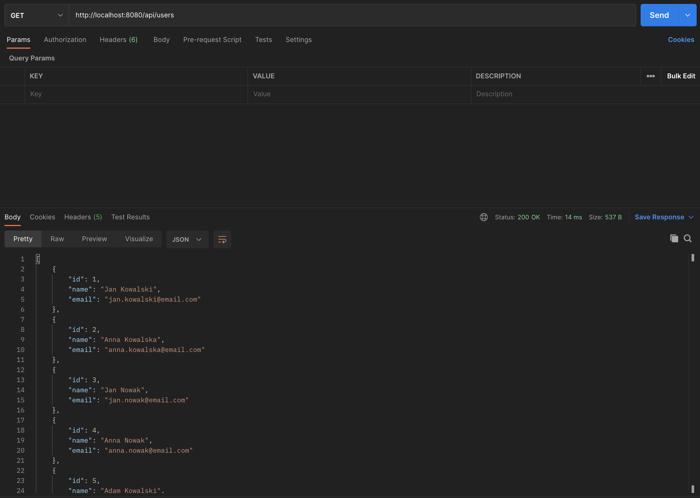

# Example Queries

## GET:
- HTTP Method: GET
- URL: http://localhost:8080/api/users
- Response: JSON with all users.

**Example:**

## GET (*by ID*):
- HTTP Method: GET
- URL: http://localhost:8080/api/users/{id}
- Path Variable: user ID number
- Response: JSON with selected user.

**Example:**

## POST:
- HTTP Method: POST
- URL: http://localhost:8080/api/user/create
- Request Body: User(*name, email*) in JSON format
- Response: JSON with created user.

**Example:**

## PUT:
- HTTP Method: PUT
- URL: http://localhost:8080/api/users/{id}/update
- Path Variable: user ID number
- Request Body: User(*name, email*) in JSON format
- Response: JSON with updated user.

**Example:**

## DELETE:
- HTTP Method: DELETE
- URL: http://localhost:8080/api/users/{id}/remove
- Path Variable: user ID number
- Response: JSON confirmation of removal.

**Example:**
